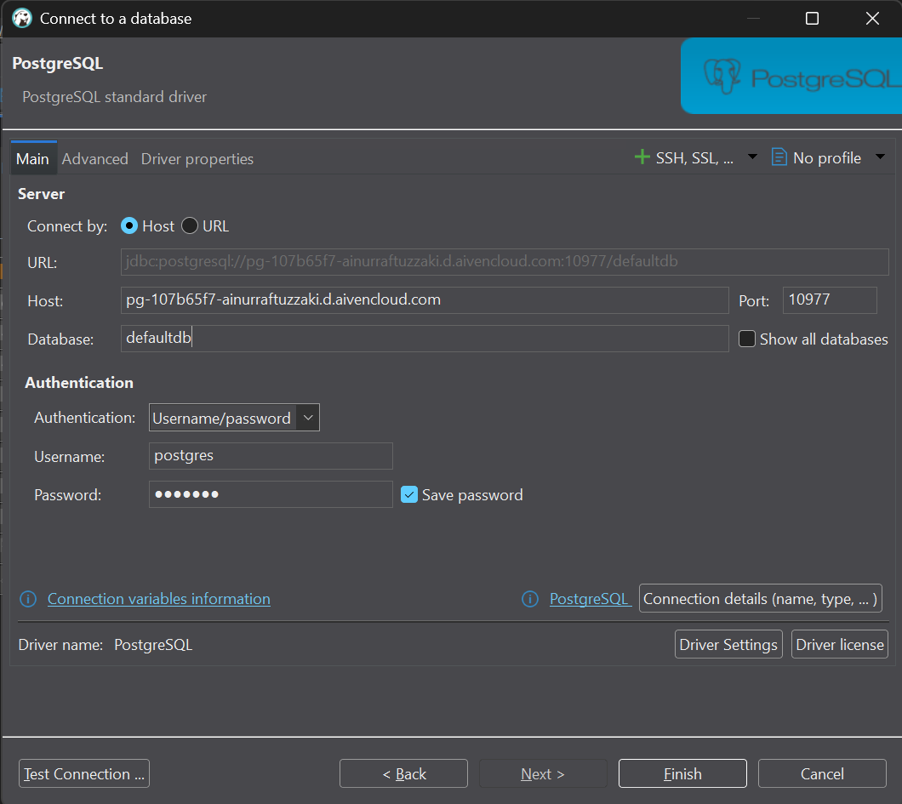
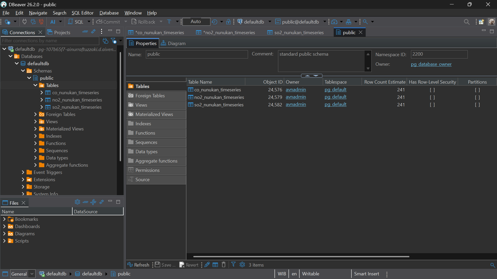
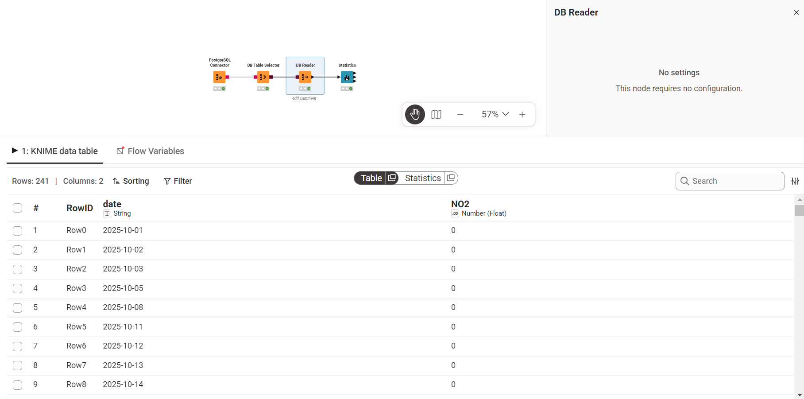
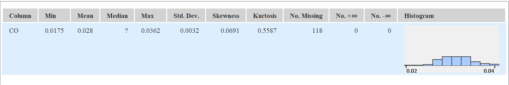
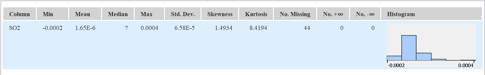
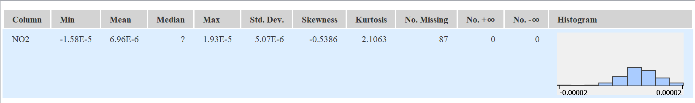

# Penjelasan Metrik Statistika Deskriptif

Dalam analisis data, ringkasan metrik yang disajikan dalam bentuk tabel disebut sebagai **Statistika Deskriptif (Descriptive Statistics)**. Ringkasan ini umumnya dimanfaatkan pada tahap awal analisis, yakni **Exploratory Data Analysis (EDA)**. Tujuannya adalah untuk memahami karakteristik, pola distribusi, serta kualitas data sebelum beralih ke tahap pemrosesan lanjutan, peramalan (*forecasting*), maupun pemodelan.

Tabel tersebut menyajikan ringkasan untuk beberapa variabel konsentrasi polutan udara ($NO_2$, $CO$, $SO_2$, $O_3$). Berikut merupakan penjelasan untuk masing-masing metrik beserta metode perhitungan manualnya:

## 1. Min & Max
*   **Penjelasan:** Merupakan nilai observasi terendah (Min) dan tertinggi (Max) dalam suatu kumpulan data. Metrik ini berguna untuk mengidentifikasi batas bawah dan batas atas dari rentang data.
*   **Perhitungan Manual:** Urutkan seluruh data mulai dari nilai yang terkecil hingga yang terbesar.
    *   $Min = X_1$ (Data pada urutan pertama)
    *   $Max = X_n$ (Data pada urutan terakhir)

## 2. Mean
*   **Penjelasan:** Merupakan nilai pusat (rata-rata) dari sekumpulan data. Nilai ini diperoleh dengan menjumlahkan seluruh observasi, kemudian membaginya dengan total jumlah observasi yang valid.
*   **Perhitungan Manual:**

    $$ \bar{x} = \frac{\sum_{i=1}^{n} x_i}{n} $$

    *(Jumlahkan seluruh nilai konsentrasi polutan, lalu bagi dengan total baris data yang tersedia)*.

## 3. Std. Deviation (Standar Deviasi)
*   **Penjelasan:** Mengukur sejauh mana rata-rata simpangan titik-titik data terhadap nilai Mean-nya. Standar deviasi yang rendah mengindikasikan bahwa data cenderung mengelompok di sekitar rata-rata (konsisten), sementara nilai yang tinggi menunjukkan adanya rentang fluktuasi yang lebar.
*   **Perhitungan Manual (Sampel):**

    $$ s = \sqrt{\frac{\sum_{i=1}^{n} (x_i - \bar{x})^2}{n-1}} $$

## 4. Variance (Varians)
*   **Penjelasan:** Merupakan rata-rata dari kuadrat selisih antara setiap titik data dengan nilai Mean. Secara matematis, varians adalah nilai kuadrat dari Standar Deviasi.
*   **Perhitungan Manual (Sampel):**

    $$ s^2 = \frac{\sum_{i=1}^{n} (x_i - \bar{x})^2}{n-1} $$

## 5. Skewness 
*   **Penjelasan:** Mengukur tingkat asimetri (ketidakseimbangan) distribusi data terhadap nilai rata-ratanya.
    *   *Skewness = 0*: Data terdistribusi secara simetris (normal) dan berpusat di tengah.
    *   *Skewness > 0 (Positif)*: Ekor distribusi memanjang ke arah kanan (menunjukkan adanya nilai ekstrem yang tinggi). Contohnya terdapat pada data observasi $SO_2$ dengan nilai 2.124.
    *   *Skewness < 0 (Negatif)*: Ekor distribusi memanjang ke arah kiri.
*   **Perhitungan Manual (Fisher-Pearson):**

    $$ Skewness = \frac{n}{(n-1)(n-2)} \sum_{i=1}^{n} \left(\frac{x_i - \bar{x}}{s}\right)^3 $$

## 6. Kurtosis
*   **Penjelasan:** Mengukur tingkat keruncingan atau bobot ekor (*tailedness*) dari suatu distribusi data. Metrik ini menunjukkan seberapa ekstrem *outlier* (pencilan) yang ada di dalam data. Sebagian besar perangkat lunak (*software*) secara khusus menghitung *Excess Kurtosis*.
    *   *Kurtosis ≈ 0*: Distribusi normal (Mesokurtik).
    *   *Kurtosis > 0*: Memiliki puncak yang tajam dengan ekor yang tebal, mengindikasikan banyaknya *outlier* ekstrem (baik tinggi maupun rendah) (Leptokurtik). Contoh ekstrem: data $SO_2$ (19.221).
    *   *Kurtosis < 0*: Puncaknya cenderung lebih datar dibandingkan distribusi normal (Platikurtik). Contoh: data $O_3$ (-0.375).
*   **Perhitungan Manual (Excess Kurtosis Sampel):**

    $$ Kurtosis = \left[ \frac{n(n+1)}{(n-1)(n-2)(n-3)} \sum \left(\frac{x_i - \bar{x}}{s}\right)^4 \right] - \frac{3(n-1)^2}{(n-2)(n-3)} $$

## 7. Overall Sum
*   **Penjelasan:** Merupakan jumlah total dari keseluruhan nilai pada variabel yang bersangkutan.
*   **Perhitungan Manual:**

    $$ Sum = \sum_{i=1}^{n} x_i $$

## 8. Metrik Kualitas / Anomali Data
Kelompok metrik ini memegang peranan krusial saat melakukan ekstraksi data mentah melalui API atau dari citra satelit, karena rentan terhadap kegagalan saat proses perekaman nilai.
*   **No. missings:** Menunjukkan jumlah sel yang kosong (NULL / NA) akibat data tidak berhasil terekam pada periode waktu tertentu.
*   **No. NaNs (Not a Number):** Menunjukkan jumlah entri yang dapat dibaca tetapi nilainya tidak terdefinisi secara matematis (contohnya 0/0).
*   **No. +infs / No. -infs:** Menunjukkan adanya nilai batas tak terhingga.
*   **Perhitungan Manual:** Menghitung frekuensi (N) kemunculan baris yang memuat nilai-nilai khusus tersebut.

## 9. Median
*   *Catatan: Pada tabel sebelumnya, nilai Median belum dihitung secara menyeluruh (ditunjukkan dengan ikon tanda tanya berwarna merah).*
*   **Penjelasan:** Merupakan nilai yang persis berada di tengah kumpulan data setelah diurutkan. Metrik ini kerap dimanfaatkan sebagai alternatif pengganti rata-rata (Mean) sebab Median tidak rentan terhadap pengaruh nilai *outlier* yang ekstrem.
*   **Perhitungan Manual:** Urutkan seluruh data mulai dari $X_1$ hingga $X_n$.
    *   Bila jumlah observasi ($n$) bernilai ganjil: $Median = X_{(n+1)/2}$
    *   Bila jumlah observasi ($n$) bernilai genap: $Median = \frac{X_{n/2} + X_{(n/2)+1}}{2}$

# **Implementasi Analisis Data Polutan: Dari Cloud Database ke KNIME**

Panduan ini menguraikan tahapan-tahapan untuk menghubungkan database PostgreSQL di platform Aiven, melakukan inspeksi data menggunakan HeidiSQL, serta mengekstraksi metrik statistika deskriptif memanfaatkan KNIME Analytics Platform.

## Langkah 1: Memperoleh Kredensial Database dari Aiven

Sebelum menyambungkan koneksi melalui aplikasi apa pun, kita membutuhkan informasi kredensial server.
1. Akses *dashboard* atau console **Aiven**, lalu arahkan ke proyek yang dimiliki.
2. Buka tab **Overview** pada layanan (*service*) PostgreSQL yang sedang beroperasi (`pg-c4fbe52`).
3. Pada bagian **Connection information**, catat parameter-parameter berikut ini:
   * **Host:** `pg-366a67e1-postgresqlpsd.e.aivencloud.com`
   * **Port:** `10977`
   * **User:** `avnadmin`
   * **Password:** (Klik ikon mata atau opsi *copy* untuk menyalin kata sandi rahasia)
   * **SSL mode:** `require`
4. Pastikan Anda telah mengunduh sertifikat SSL (klik **Show** pada bagian *CA certificate* kemudian unduh) apabila *client* yang Anda gunakan mensyaratkannya.

---
## Langkah 2: Mengonfigurasi Koneksi di dbeaver

dbeaver digunakan untuk meninjau tabel beserta datanya secara langsung sebelum diproses lebih lanjut.
1. Buka aplikasi **dbeaver**. Pada panel sebelah kiri (Browser), klik new data conection
2. Pilih jenis database yang akan digunakan, pilih PostgreSQL.
3. Pada ke tab **Connection**, terapkan konfigurasi di bawah ini:
   * **Host name/address:** Isikan informasi Host yang diperoleh dari langkah 1.
   * **Port:** Isikan `10977` (atau sesuai dengan *Port* pada langkah 1).
   * **Username:** Ketikkan `avnadmin`.
   * **Password:** Tempelkan (*paste*) kata sandi dari langkah 1, dan centang opsi **Save password?**.
4. Klik **Finish** guna menyimpan konfigurasi dan memulai koneksi.

---

## Langkah 3: Melakukan Inspeksi Tabel Data di dbeaver

Setelah koneksi berhasil, kita perlu memverifikasi ketersediaan data mentah beserta kesesuaian formatnya.
1. Pada panel sebelah kiri dbeaver, navigasikan *tree* server yang baru dibuat menuju Databases > `defaultdb` > Schemas > `public` > Tables.
2. Pada tables, kemudian pilih **View/Edit Data** > **All Rows**.
3. Pastikan kolom data deret waktu (*time-series*) telah ditampilkan dengan tepat, yang meliputi kolom `date`, `no2`, `co`, dan `so2` .
4. Perlu diketahui bahwa pada tahapan ini merupakan hal yang lumrah bila dijumpai nilai `[null]`. Nantinya, nilai tersebut akan teridentifikasi sebagai *missing values* pada saat tahap analisis.

---

## Langkah 4: Menyusun Alur Kerja (Workflow) di KNIME

Beralih menuju KNIME Analytics Platform guna menarik data dari database dan melakukan perhitungan statistiknya secara otomatis.
1. Jalankan **KNIME Analytics Platform** lalu buatlah *workflow* (alur kerja) yang baru.
2. Tarik (*drag-and-drop*) *node* di bawah ini dari *Node Repository* menuju ke *workspace*:
   * **PostgreSQL Connector:** Berfungsi menghubungkan KNIME dengan server Aiven.
   * **DB Table Selector:** Berfungsi untuk menyeleksi tabel di dalam database.
   * **DB Reader:** Berfungsi untuk memuat tabel ke dalam memori KNIME.
   * **Statistics:** Berfungsi untuk menghitung metrik-metrik statistik.
3. Hubungkan setiap *node* tersebut mengikuti urutan yang telah disebutkan di atas.
4. **Konfigurasi Node:**
   * Lakukan klik ganda pada **PostgreSQL Connector**, lalu isikan *Hostname*, *Port*, *Database name* (`PSD_Polutan`), serta *Credentials* (User & Password) yang identik dengan langkah 1 dan 2.
   * Lakukan klik ganda pada **DB Table Selector**, kemudian pilih skema `public` serta tabel `polutan`.
5. Klik kanan pada **DB Reader** lalu pilih opsi **Execute**. Jika prosesnya berhasil, lampu indikator di bagian bawah *node* akan berubah menjadi hijau.

---

## Langkah 5: Membaca Output Statistika Deskriptif

Setelah data berhasil dimuat ke dalam KNIME, tahapan yang terakhir adalah menjalankan perhitungan analitiknya.
1. Klik kanan pada node **Statistics** kemudian pilih **Execute**.
2. Bila lampu indikator telah berwarna hijau, klik kanan kembali pada node **Statistics** lalu pilih menu **Statistics View** (atau ikon bergambar kaca pembesar).
3. Tabel metrik statistik akan ditampilkan, yang memuat:
   * **Min, Max, Mean:** Guna mengamati rentang serta nilai rata-rata dari masing-masing polutan.
   * **Std. deviation & Variance:** Guna meninjau tingkat fluktuasi nilai gas di udara.
   * **Skewness & Kurtosis:** Guna melihat bentuk asimetri dan tingkat keberadaan nilai-nilai yang ekstrem (*outlier*).
   * **No. missings:** Menyatakan jumlah data yang kosong (sebagai contoh, pada gas $CO$ terdapat 73 data yang kosong).
   * **Histogram:** Menyajikan visualisasi mengenai sebaran datanya.

