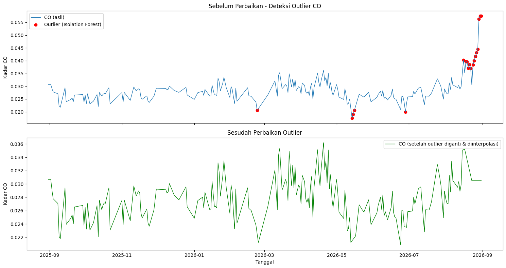
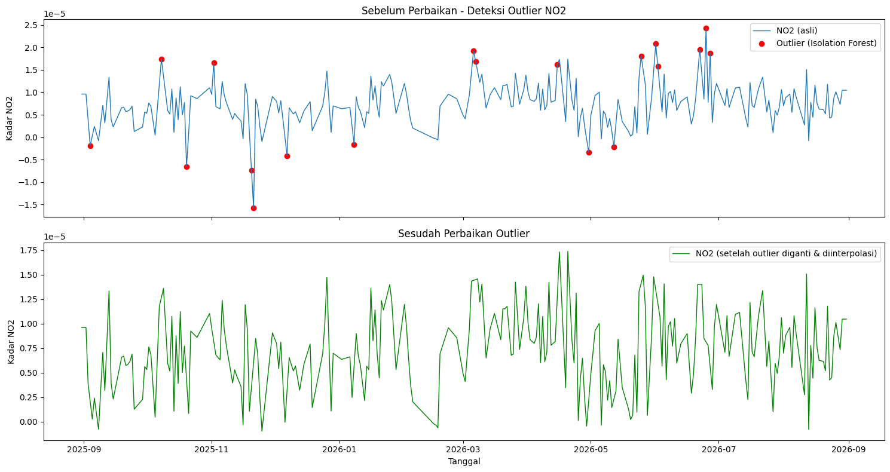
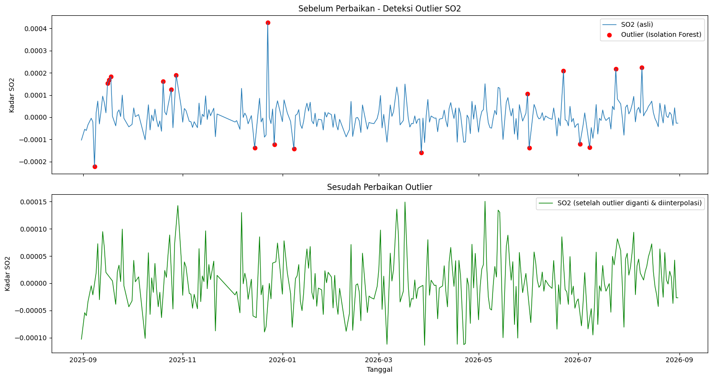

# Preprocessing Sebelum Ekstraksi Fitur

Tahap ini melanjutkan data kualitas udara **Kabupaten Nunukan** (CO, NO2, SO2) yang
sudah dikumpulkan pada tugas sebelumnya. Sebelum data dipakai untuk ekstraksi fitur,
data perlu melalui tiga tahap preprocessing: **deteksi & perbaikan outlier**,
**imputasi missing value**, lalu **ekstraksi fitur** dengan TSFEL.

Seluruh data pada tahap ini sudah difilter sesuai wilayah Kabupaten Nunukan
(kecamatan/kabupaten masing-masing mahasiswa), mengikuti data yang sudah dikumpulkan
pada tugas crawling sebelumnya.

## 1. Deteksi & Perbaikan Outlier

Deteksi outlier dilakukan dengan **Isolation Forest** (asumsi 5% data adalah anomali),
lalu nilai yang terdeteksi sebagai outlier diganti `NaN` dan diisi ulang dengan
interpolasi linear terhadap waktu.

```python
import pandas as pd
import numpy as np
import matplotlib.pyplot as plt
from sklearn.ensemble import IsolationForest

POLLUTANTS = ["CO", "NO2", "SO2"]
CONTAMINATION = 0.05

for pol in POLLUTANTS:
    # 1. Load data hasil imputasi missing value
    df = pd.read_csv(f"{pol}_Nunukan_Timeseries_imputed.csv")
    df = df.dropna(subset=[pol]).copy()
    df["date"] = pd.to_datetime(df["date"])
    df = df.sort_values("date").reset_index(drop=True)

    # 2. Deteksi outlier dengan Isolation Forest
    model = IsolationForest(contamination=CONTAMINATION, random_state=42)
    pred = model.fit_predict(df[[pol]])
    df["anomaly"] = pred  # -1 = outlier, 1 = normal
    outliers = df[df["anomaly"] == -1]
    print(f"[{pol}] Jumlah outlier terdeteksi: {len(outliers)} dari {len(df)} data")

    # 3. Ganti outlier jadi NaN, lalu interpolasi
    df_fixed = df.copy()
    df_fixed.loc[df_fixed["anomaly"] == -1, pol] = np.nan
    df_fixed[pol] = df_fixed[pol].interpolate(method="linear").ffill().bfill()

    # 4. Plot sebelum vs sesudah
    fig, axes = plt.subplots(2, 1, figsize=(15, 8), sharex=True)
    axes[0].plot(df["date"], df[pol], label=f"{pol} (asli)", linewidth=1)
    axes[0].scatter(outliers["date"], outliers[pol], color="red",
                     marker="o", label="Outlier (Isolation Forest)", zorder=5)
    axes[0].set_title(f"Sebelum Perbaikan - Deteksi Outlier {pol}")
    axes[0].legend()

    axes[1].plot(df_fixed["date"], df_fixed[pol], color="green", linewidth=1,
                 label=f"{pol} (setelah outlier diganti & diinterpolasi)")
    axes[1].set_title(f"Sesudah Perbaikan Outlier {pol}")
    axes[1].legend()

    plt.tight_layout()
    plt.savefig(f"outlier_{pol}_before_after.png", dpi=150)

    df_fixed[["date", pol]].to_csv(f"{pol}_Nunukan_Timeseries_fixed.csv", index=False)
```

**Ringkasan outlier yang terdeteksi:**

| polutan   |   n_data |   n_outlier |   pct_outlier | tgl_outlier_pertama   | tgl_outlier_terakhir   |
|:----------|---------:|------------:|--------------:|:----------------------|:-----------------------|
| CO        |      366 |          19 |          5.19 | 2026-02-23            | 2026-08-31             |
| NO2       |      366 |          19 |          5.19 | 2025-09-04            | 2026-06-27             |
| SO2       |      366 |          19 |          5.19 | 2025-09-08            | 2026-08-09             |

### Grafik CO sebelum & sesudah perbaikan



> **Catatan tentang lonjakan CO di akhir Agustus 2026**
> Pada rentang 21–31 Agustus 2026, kadar CO naik tajam dan seluruhnya terdeteksi
> sebagai outlier oleh Isolation Forest, dengan nilai tertinggi sepanjang data
> tercatat pada 30–31 Agustus 2026. Lonjakan ini bertepatan dengan periode karhutla
> (kebakaran hutan dan lahan) yang meluas di berbagai wilayah Kalimantan pada
> Agustus 2026 akibat musim kemarau panjang yang diperparah El Niño. Asap kebakaran
> yang terbawa angin memicu kenaikan konsentrasi CO di udara meski jumlah titik
> panas di sekitar Nunukan (Kalimantan Utara) sendiri relatif lebih sedikit
> dibanding Kalimantan Tengah dan Kalimantan Barat. Karena nilainya jauh di luar
> pola historis, algoritma outlier tetap menandainya sebagai anomali, sehingga pada
> data yang sudah "fixed" lonjakan ini diratakan lewat interpolasi perlu dicatat
> di laporan bahwa event asap ini adalah kejadian nyata, bukan noise sensor.

### Grafik NO2 sebelum & sesudah perbaikan



### Grafik SO2 sebelum & sesudah perbaikan



## 2. Imputasi Missing Value

Missing value pada data mentah (166 hari kosong pada CO, 124 pada NO2, 55 pada SO2
dari total 366 hari) sudah diisi penuh pada tahap sebelumnya (file `*_imputed.csv`)
menggunakan interpolasi/forward-fill, sehingga tidak ada lagi nilai kosong yang
masuk ke tahap ekstraksi fitur.

## 3. Ekstraksi Fitur dengan TSFEL

Ekstraksi fitur memakai [TSFEL](https://tsfel.readthedocs.io/), menghasilkan
**68 fitur** dari 3 domain (statistical, temporal, spectral) untuk masing-masing
polutan. TSFEL versi terbaru memisahkan 6 fitur non-linear (`dfa`,
`higuchi_fractal_dimension`, `hurst_exponent`, `lempel_ziv`,
`maximum_fractal_length`, `petrosian_fractal_dimension`, `mse`) ke domain
*fractal* tersendiri; karena tugas ini hanya meminta 3 domain, fitur-fitur
tersebut digabungkan ke kelompok **Temporal** sesuai pengelompokan awal TSFEL.

```python
import pandas as pd
import numpy as np
import inspect
import tsfel.feature_extraction.features as tsfel_features

POLLUTANTS = ["CO", "NO2", "SO2"]
fs = 1  # 1 observasi per hari

FEATURE_LIST = """abs_energy auc autocorr average_power calc_centroid calc_max calc_mean
calc_median calc_min calc_std calc_var dfa distance ecdf ecdf_percentile ecdf_percentile_count
ecdf_slope entropy fundamental_frequency higuchi_fractal_dimension hist_mode human_range_energy
hurst_exponent interq_range kurtosis lempel_ziv lpcc max_frequency max_power_spectrum
maximum_fractal_length mean_abs_deviation mean_abs_diff mean_diff median_abs_deviation
median_abs_diff median_diff median_frequency mfcc mse negative_turning neighbourhood_peaks
petrosian_fractal_dimension pk_pk_distance positive_turning power_bandwidth rms skewness slope
spectral_centroid spectral_decrease spectral_distance spectral_entropy spectral_kurtosis
spectral_positive_turning spectral_roll_off spectral_roll_on spectral_skewness spectral_slope
spectral_spread spectral_variation spectrogram_mean_coeff sum_abs_diff wavelet_abs_mean
wavelet_energy wavelet_entropy wavelet_std wavelet_var zero_cross""".split()


def to_scalar(result):
    if isinstance(result, dict) and "values" in result:
        result = result["values"]
    if isinstance(result, (list, tuple, np.ndarray)):
        return float(np.nanmean(np.asarray(result, dtype=float)))
    return float(result)


def extract_one(fn_name, signal, fs):
    fn = getattr(tsfel_features, fn_name)
    params = inspect.signature(fn).parameters
    result = fn(signal, fs) if "fs" in params else fn(signal)
    return to_scalar(result)


for pol in POLLUTANTS:
    df = pd.read_csv(f"{pol}_Nunukan_Timeseries_fixed.csv")
    df["date"] = pd.to_datetime(df["date"])
    df = df.sort_values("date").reset_index(drop=True)
    df[pol] = pd.to_numeric(df[pol], errors="coerce")

    # safety check outlier tambahan (IQR) sebelum ekstraksi fitur
    Q1, Q3 = df[pol].quantile(0.25), df[pol].quantile(0.75)
    IQR = Q3 - Q1
    df.loc[(df[pol] < Q1 - 1.5*IQR) | (df[pol] > Q3 + 1.5*IQR), pol] = np.nan
    df_clean = df.set_index("date").interpolate(method="time").ffill().bfill()
    signal_1d = df_clean[pol].astype(float).values

    row = {fn_name: extract_one(fn_name, signal_1d, fs) for fn_name in FEATURE_LIST}
    pd.DataFrame([row]).to_csv(f"{pol}_Nunukan_TSFEL.csv", index=False)
```

### Hasil ekstraksi fitur per domain

**Statistical Domain (21 fitur)**

| Fitur                 |            CO |             NO2 |            SO2 |
|:----------------------|--------------:|----------------:|---------------:|
| abs_energy            |   0.27862     |     2.36373e-08 |    7.22931e-07 |
| average_power         |   0.000763342 |     6.47597e-11 |    1.98063e-09 |
| calc_max              |   0.0348969   |     1.50682e-05 |    0.00010691  |
| calc_mean             |   0.0274505   |     7.09712e-06 |   -2.04958e-06 |
| calc_median           |   0.0271924   |     6.97647e-06 |   -3.81442e-06 |
| calc_min              |   0.0208626   |    -9.81828e-07 |   -0.000112941 |
| calc_std              |   0.00277938  |     3.77011e-06 |    4.43962e-05 |
| calc_var              |   7.72493e-06 |     1.42137e-11 |    1.97102e-09 |
| ecdf                  |   0.0150273   |     0.0150273   |    0.0150273   |
| ecdf_percentile       |   0.027383    |     6.98326e-06 |   -2.05955e-06 |
| ecdf_percentile_count | 182.5         |   182.5         |  182.5         |
| ecdf_slope            | 113.63        | 95097.9         | 8678.75        |
| entropy               |   0.989321    |     0.996949    |    0.999358    |
| hist_mode             |   0.0257746   |     6.2407e-06  |   -1.40084e-05 |
| interq_range          |   0.00377363  |     5.13729e-06 |    5.45609e-05 |
| kurtosis              |  -0.315646    |    -0.603237    |   -0.113452    |
| mean_abs_deviation    |   0.00226385  |     3.05789e-06 |    3.46067e-05 |
| median_abs_deviation  |   0.00195732  |     2.56269e-06 |    2.66183e-05 |
| pk_pk_distance        |   0.0140343   |     1.60501e-05 |    0.000219851 |
| rms                   |   0.0275909   |     8.03634e-06 |    4.44435e-05 |
| skewness              |   0.184097    |    -0.0531476   |    0.0190117   |

**Temporal Domain (21 fitur, termasuk sub-kategori fraktal)**

| Fitur                       |            CO |           NO2 |           SO2 |
|:----------------------------|--------------:|--------------:|--------------:|
| auc                         |  10.0163      |   0.00258932  |   0.0103055   |
| autocorr                    |   7           |   2           |   1           |
| calc_centroid               | 187.754       | 200.32        | 180.522       |
| dfa                         |   1.09545     |   0.850275    |   0.719522    |
| distance                    | 365.001       | 365           | 365           |
| higuchi_fractal_dimension   |   1.79642     |   1.88136     |   1.94272     |
| hurst_exponent              |   0.868289    |   0.717144    |   0.701121    |
| lempel_ziv                  |   0.166667    |   0.188525    |   0.202186    |
| maximum_fractal_length      |  -0.245368    |  -2.95763     |  -1.80483     |
| mean_abs_diff               |   0.00123694  |   2.56689e-06 |   3.90704e-05 |
| mean_diff                   |  -5.29308e-07 |   2.33994e-09 |   2.08623e-07 |
| median_abs_diff             |   0.00067574  |   1.66529e-06 |   2.94622e-05 |
| median_diff                 |   2.16304e-05 |   0           |  -1.59603e-06 |
| mse                         |   1.12817     |   1.17814     |   1.35631     |
| negative_turning            |  59           |  76           |  93           |
| neighbourhood_peaks         |  15           |  17           |  20           |
| petrosian_fractal_dimension |   1.02132     |   1.0269      |   1.03269     |
| positive_turning            |  59           |  75           |  94           |
| slope                       |   6.19674e-06 |   7.2994e-09  |   1.87767e-08 |
| sum_abs_diff                |   0.451485    |   0.000936914 |   0.0142607   |
| zero_cross                  |   0           |  16           | 122           |

**Spectral Domain (26 fitur)**

| Fitur                     |              CO |          NO2 |          SO2 |
|:--------------------------|----------------:|-------------:|-------------:|
| fundamental_frequency     |     0.00819672  |  0.00273224  |  0.00273224  |
| human_range_energy        |     0           |  0           |  0           |
| lpcc                      |     0.917156    |  0.588063    |  0.0971075   |
| max_frequency             |     0.382514    |  0.456284    |  0.464481    |
| max_power_spectrum        |    49.0833      | 37.7626      | 12.4217      |
| median_frequency          |     0           |  0.112022    |  0.202186    |
| mfcc                      |     8.43143     | 36.2542      | 42.3883      |
| power_bandwidth           |     0.352459    |  0.382514    |  0.434426    |
| spectral_centroid         |     0.065298    |  0.159281    |  0.217667    |
| spectral_decrease         |    -8.90315     | -1.366       |  0.00925378  |
| spectral_distance         | -1124.99        | -0.442803    | -1.68649     |
| spectral_entropy          |     0.671061    |  0.833144    |  0.90735     |
| spectral_kurtosis         |     5.95697     |  2.15339     |  1.84302     |
| spectral_positive_turning |    54           | 57           | 64           |
| spectral_roll_off         |     0.382514    |  0.456284    |  0.464481    |
| spectral_roll_on          |     0           |  0           |  0.0163934   |
| spectral_skewness         |     2.00925     |  0.679461    |  0.269873    |
| spectral_slope            |    -0.0476622   | -0.02341     | -0.0083436   |
| spectral_spread           |     0.123825    |  0.15516     |  0.145901    |
| spectral_variation        |     0.850024    |  0.564399    |  0.204832    |
| spectrogram_mean_coeff    |     1.28763e-05 |  2.5104e-11  |  3.70916e-09 |
| wavelet_abs_mean          |     0.00169461  |  3.50057e-07 |  5.04035e-07 |
| wavelet_energy            |     0.00760351  |  5.42583e-06 |  5.59249e-05 |
| wavelet_entropy           |     2.08358     |  2.17228     |  2.18574     |
| wavelet_std               |     0.0073996   |  5.41274e-06 |  5.59222e-05 |
| wavelet_var               |     6.59076e-05 |  3.11213e-11 |  3.19528e-09 |

## Ringkasan

| Tahap | Keterangan |
|---|---|
| Preprocessing | Data difilter sesuai Kabupaten Nunukan, missing value diimputasi penuh (0 nilai kosong tersisa dari 366 hari), outlier dideteksi dengan Isolation Forest (~5,19% data per polutan) dan diperbaiki lewat interpolasi waktu |
| Catatan khusus | Lonjakan CO akhir Agustus 2026 teridentifikasi sebagai outlier statistik, namun sebenarnya mencerminkan kejadian nyata (karhutla/asap Kalimantan), bukan kesalahan data |
| Ekstraksi fitur | 68 fitur time series diekstrak dengan TSFEL untuk tiap polutan, terbagi ke domain Statistical (21), Temporal (21, termasuk fraktal), dan Spectral (26) |